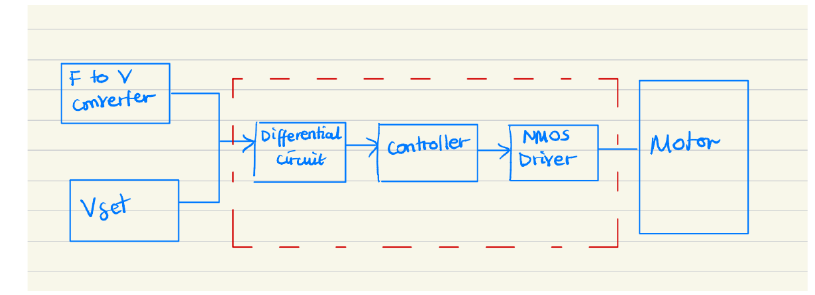
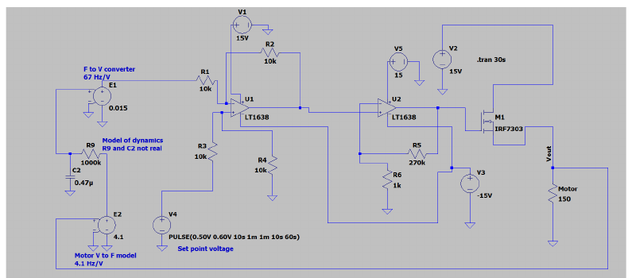
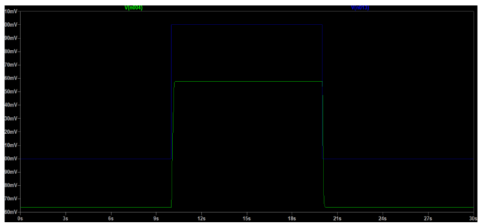
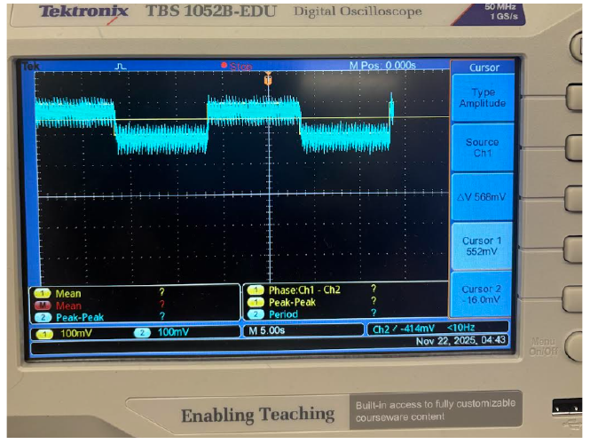
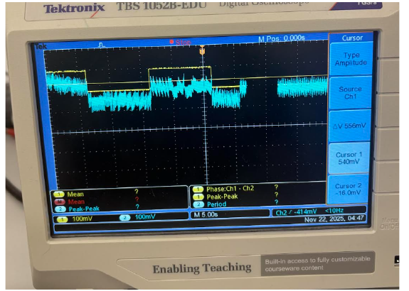

# Closed-Loop DC Motor Speed Controller

A closed-loop analog control system designed to regulate the speed of a small DC motor using Hall-effect sensor feedback.

The system measures the motor speed, compares it with a desired reference speed, and automatically adjusts the motor drive voltage to reduce the error.

## Project Overview

The goal of this project was to design and build a feedback controller capable of maintaining a desired DC motor speed under changing operating conditions.

The system was designed around two target speed setpoints represented by reference voltages. A Hall-effect sensor measured the motor's rotational speed, while a frequency-to-voltage converter produced a feedback voltage proportional to the measured speed.

The controller then compared the reference and feedback signals and adjusted the motor drive accordingly.

## System Architecture

The main signal path was:

**Reference Voltage → Error Detection → Controller → NMOS Motor Driver → DC Motor**

with feedback provided through:

**DC Motor → Hall-Effect Sensor → Frequency-to-Voltage Converter → Error Detection**

## My Design Work

My main design responsibilities included:

- Designing the difference amplifier used to calculate the speed error
- Designing the analog controller used to amplify the error signal
- Selecting component values for the controller
- Implementing the NMOS motor-drive stage
- Simulating the complete control system in LTspice
- Building and testing the circuit
- Evaluating the controller under different motor loads
- Troubleshooting and redesigning the controller when the initial design saturated

## Design Iteration

The first controller design used an inverting PI amplifier. During testing, the circuit saturated because the op-amp could not produce the required output under the available supply conditions.

The controller was redesigned as a non-inverting high-gain amplifier.

The final controller used:

- **Rin:** 1 kΩ
- **Rf:** 270 kΩ
- **Approximate gain:** 270 V/V

This allowed small error signals to create a much larger motor-control signal.

## Hardware and Components

- DC motor with Hall-effect speed sensor
- LM2917 frequency-to-voltage converter
- LM358 operational amplifiers
- NMOS transistor motor driver
- Resistors and capacitors
- Function generator
- Oscilloscope
- DC power supply
- Breadboard

## Software and Tools

- LTspice
- Oscilloscope measurements
- Analog circuit design
- Feedback control
- Circuit simulation and testing

## Simulation

The complete controller was simulated in LTspice before hardware testing.

### Circuit Simulation

### Simulated Response

The simulation was used to verify that the feedback voltage followed changes in the reference voltage and that the controller responded correctly when the requested motor speed changed.

## Testing and Results

The completed system successfully tracked the requested speed setpoints under no-load conditions.

### No-Load Testing

Under moderate loading, the controller automatically increased its output to compensate for the reduction in motor speed while maintaining stable operation.

Under heavy loading near the motor's limit, the system could no longer maintain the requested speed within the desired accuracy. This helped identify limitations associated with the available motor torque, controller output, and motor-driver configuration.

### Load Testing

## What I Learned

This project gave me practical experience with:

- Closed-loop feedback control
- Analog controller design
- Op-amp circuits
- MOSFET motor driving
- Hall-effect speed sensing
- LTspice simulation
- Oscilloscope measurements
- Hardware troubleshooting
- Comparing simulated and experimental results

One of the most valuable parts of the project was learning how to troubleshoot a controller that worked differently in hardware than expected and redesign the circuit based on the observed behaviour.

## Future Improvements

Possible improvements include:

- Improving the motor-driver stage to reduce voltage loss
- Implementing a more advanced PI/PID controller
- Improving performance under heavier loads
- Comparing different controller gains and their effect on transient response
